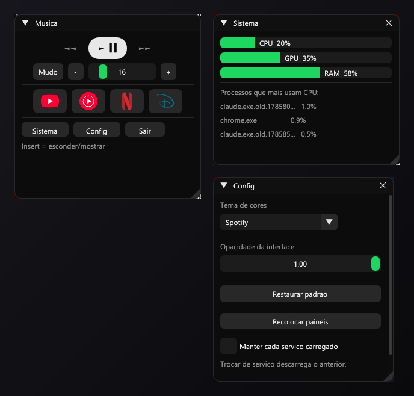
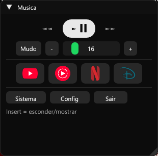
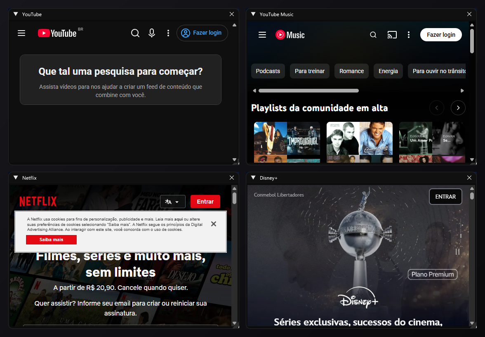
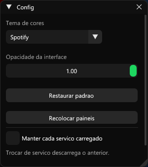
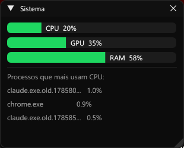

<div align="center">

# ◈ Nimbus

**Um painel de controle que flutua sobre o Windows.**

Volume, música, vídeo e monitoramento do PC sempre à mão — sem trocar de janela,
sem procurar ícone na bandeja, sem tirar o foco do que você está fazendo.

[](https://go.dev)
[](https://github.com/AllenDang/giu)
[](https://learn.microsoft.com/microsoft-edge/webview2/)
[](#)
[](LICENSE)

*Feito por **KST***



</div>

---

## Índice

- [O que é](#o-que-é)
- [Cada função, e para que serve](#cada-função-e-para-que-serve)
- [Instalação](#instalação)
- [Como usar](#como-usar)
- [Como funciona por dentro](#como-funciona-por-dentro)
- [Estrutura do projeto](#estrutura-do-projeto)
- [Testes](#testes)
- [Quando algo dá errado](#quando-algo-dá-errado)
- [Bibliotecas](#bibliotecas)

---

## O que é

O Nimbus não é uma janela comum. É uma **camada invisível que cobre todos os seus
monitores**, e dentro dela flutuam painéis independentes que você move, redimensiona
e junta como quiser — inclusive levando de uma tela para outra.

Nos espaços vazios entre os painéis, **o clique atravessa**: você continua clicando
normalmente no que está atrás, como se o Nimbus não estivesse ali. É a mesma técnica
dos overlays do Discord e do MSI Afterburner.

Ele também **não aparece na barra de tarefas nem no Alt+Tab**, e não rouba o foco da
janela em que você está trabalhando.

---

## Cada função, e para que serve

### 🔊 Controle de volume



Slider, botões **−** / **+** e **Mudo**, mexendo no volume geral do Windows.

**Para que serve:** trocar o volume sem sair do que você está fazendo — sem
abrir o misturador, sem procurar o ícone do alto-falante, sem tirar o foco do
jogo ou da chamada. O botão de mudo fica **verde** quando o som está cortado,
para você ver de longe que o microfone do vídeo não está no ar por causa disso.

O valor mostrado é sempre o **real** do Windows: se você mexer no volume pelo
teclado ou por outro programa, o slider acompanha.

### ⏯️ Controle de mídia

Botões **anterior**, **play/pause** e **próxima**.

**Para que serve:** controlar o que está tocando **em qualquer programa** —
Spotify, VLC, navegador, YouTube. Funciona porque o Nimbus simula as teclas de
mídia do teclado, então quem estiver tocando obedece. É especialmente útil em
teclado que não tem essas teclas.

### 📺 Serviços de vídeo embutidos

Quatro botões com as logos: **YouTube**, **YouTube Music**, **Netflix** e **Disney+**.

**Para que serve:** assistir ou ouvir **dentro do próprio overlay**, sem abrir o
navegador e sem perder de vista o que você está fazendo. A janelinha do player
flutua como qualquer painel: você move, redimensiona e deixa num canto da tela.

Os quatro serviços ficam num **menu lateral** no painel Música (as logos, uma
embaixo da outra), com os controles ao lado. A janelinha do player é **só o
navegador** — nenhum espaço desperdiçado com botões.

- **Clique esquerdo** → abre dentro do Nimbus.
- **Clique direito** → abre no seu navegador de verdade.

<div align="center">



*Os quatro serviços rodando dentro do overlay. Cada um numa janelinha que você
move, redimensiona e junta com os outros painéis.*

</div>

O serviço que está carregado ganha um **risquinho verde** embaixo do ícone.

> ⚠️ **Netflix e Disney+ usam DRM** (proteção de conteúdo). Os sites **abrem e
> navegam normalmente** dentro do Nimbus (como nas imagens acima), mas o navegador
> embutido não traz o componente que decifra conteúdo protegido — então a
> reprodução do filme pode ser recusada. Nesse caso use o **clique direito**: o
> navegador normal tem o DRM. YouTube e YouTube Music funcionam embutidos,
> inclusive tocando.

### 🎧 Modo "só escutar"

Botão **Sem vídeo** quando um serviço está aberto.

**Para que serve:** ouvir uma playlist sem a imagem ocupando a tela. Esconde só
o vídeo — **a música continua tocando** — e a janelinha some, ficando só os
controles. O botão vira **Ver vídeo** para trazer a imagem de volta, do ponto
onde estava.

### 🗂️ Dois modos de player (opção na Config)



A opção **"Manter cada serviço carregado"** decide o que acontece ao trocar de
serviço:

| Modo | O que faz | Quando usar |
|---|---|---|
| **Desligado** (padrão) | Um navegador só. Trocar descarrega o anterior — como digitar outro endereço na mesma aba. | Uso normal: gasta pouca memória. |
| **Ligado** | Um navegador **por serviço**, criado só no primeiro uso daquele serviço. Trocar apenas esconde um e mostra o outro. | Quando você quer **deixar a música tocando** no YT Music e ir ver algo no YouTube. |

**Por que existe a escolha:** manter tudo carregado é confortável, mas cada
navegador abre seus próprios processos e consome memória. A linha abaixo da opção
mostra quantos serviços estão carregados neste momento.

### 📊 Monitoramento do PC



Barras de **CPU**, **GPU** e **memória RAM**, mais os **3 processos que mais
consomem CPU**, atualizando a cada 2 segundos.

**Para que serve:** descobrir na hora por que o computador ficou lento, sem
abrir o Gerenciador de Tarefas (que, sendo uma janela normal, tiraria o foco do
que você está fazendo). Os processos aparecem com nome e porcentagem, então dá
para identificar o culpado de imediato.

As medições rodam **em segundo plano**: a interface nunca fica esperando por elas.

### 🎨 Temas e opacidade

**7 paletas** prontas — Crimson, Midnight, Ocean, Forest, Amethyst, Spotify e
Mono — e um slider de **opacidade** de 30% a 100%.

**Para que serve:** a opacidade deixa o Nimbus discreto sobre o que está atrás
(útil quando ele fica sobre um texto que você precisa ler). E o tema é derivado:
você escolhe uma paleta e as ~20 cores da interface são **calculadas** a partir
de 5 cores base, então nada fica desarmônico.

A opacidade vale **também para o vídeo** — não só para os painéis.

### 🪟 Juntar painéis em abas

Arraste um painel sobre o outro e eles viram **uma única janela com abas**.

**Para que serve:** juntar tudo num só lugar quando a tela está cheia, em vez de
ter três janelinhas espalhadas. Arraste a aba para fora para separar de novo.

### 🫥 Esconder tudo (tecla Insert)

**Para que serve:** limpar a tela num instante — numa apresentação, numa gravação,
ou quando o overlay atrapalha. Aperta **Insert** e tudo desaparece, **o som
continua**; aperta de novo e volta exatamente como estava.

Funciona também pelo **ícone na bandeja** do sistema (ao lado do relógio): clique
esconde/mostra, botão direito abre um menu com *Sair*.

### 🧭 Recolocar painéis

Botão na aba Config.

**Para que serve:** rede de segurança. Se um painel for arrastado para um canto
ruim da tela, ou ficar recolhido em lugar difícil, este botão traz todos de volta
para as posições originais e os desdobra.

---

## Instalação

**Você precisa de:**

- **Windows 10 ou 11**
- **[Go 1.26+](https://go.dev/dl/)**
- **Um compilador C (GCC)** — o Dear ImGui é escrito em C++, então o Go precisa
  dele. No Windows, o caminho mais fácil:

  ```powershell
  winget install --id=BrechtSanders.WinLibs.POSIX.UCRT -e
  ```

  Depois **abra um terminal novo** (o PATH só vale em janelas abertas após a
  instalação).

- **WebView2** — já vem no Windows 10/11 atualizado; é o que permite o player
  embutido. Sem ele, os botões dos serviços abrem no navegador padrão.

**Para compilar e abrir:**

```powershell
git clone https://github.com/<seu-usuario>/nimbus.git
cd nimbus
.\compilar.bat
```

> ⏱️ A **primeira** compilação leva alguns minutos, porque o Go compila todo o
> Dear ImGui (C++) uma vez. Depois disso fica em cache e recompilar leva segundos.

Ou na mão:

```powershell
go build -ldflags "-H=windowsgui" -o build/nimbus.exe .
.\build\nimbus.exe
```

O `-H=windowsgui` esconde a janela preta do terminal — é um app de janela, não de
linha de comando.

---

## Como usar

| Ação | Como |
|:--|:--|
| Mover um painel | Arraste pela barra de título |
| Redimensionar | Puxe o canto inferior direito |
| Recolher | Clique na setinha ▼ ao lado do título |
| Levar para outro monitor | Arraste normalmente, atravessa as telas |
| Juntar em abas | Arraste um painel sobre o outro |
| Esconder / mostrar tudo | Tecla **Insert**, ou clique no ícone da bandeja |
| Menu rápido | Botão direito no ícone da bandeja |
| Abrir um serviço | Clique no ícone (direito abre no navegador) |
| Abrir Sistema / Config | Botões no painel Música |
| Voltar tudo ao lugar | **Recolocar painéis**, na aba Config |
| Fechar o Nimbus | Botão **Sair**, ou pelo menu da bandeja |

> 💡 Não achou o ícone da bandeja? Clique na **setinha `^`** ao lado do relógio: o
> Windows esconde ali os ícones novos. Arraste o do Nimbus para fora para fixá-lo.

---

## Como funciona por dentro

### Dois desenhistas, uma janela

Essa é a ideia central do Nimbus, e entender ela explica todo o resto:

| Parte | Quem desenha |
|---|---|
| Painéis, botões, sliders, ícones | **o nosso código**, com Dear ImGui + OpenGL |
| A página do YouTube / Netflix | **o motor do Edge** (WebView2), em processos próprios |

Os dois são **independentes** e não conversam. A única coisa que o nosso código
faz com o navegador é dizer **onde** ele fica — o retângulo.

É como colar uma **televisãozinha ligada** numa folha de vidro onde a gente
desenha: podemos mover a TV, escondê-la, mudar o tamanho dela… mas não podemos
desenhar por cima da imagem, nem pintá-la, nem saber o que está passando.

Consequências práticas, todas tratadas no código:

| Consequência | Como foi resolvido |
|---|---|
| O vídeo fica sempre por cima dos painéis | Ele **sai da frente** quando o cursor está sobre um painel que o cobre |
| A opacidade dos painéis não afeta o vídeo | Pedimos a transparência ao navegador, injetando CSS na página |
| O vídeo não sabe que o painel foi recolhido | A interface **avisa**: se a janelinha não foi desenhada, o vídeo se esconde |
| Caixas de diálogo nascem atrás do overlay | Ao detectar uma, o overlay **sai do topo** e deixa o clique passar |
| O teclado não chegava ao player | O estilo que impede o foco é **removido enquanto o player está aberto** |

### A janela fantasma

A camada invisível segue uma receita de sete partes — todas necessárias:

1. **Uma janela só**, do tamanho de todos os monitores, sem moldura, sempre por cima.
2. **Transparência real por pixel** (DWM + fundo com alfa 0), não "cor-chave".
3. **Clique atravessa** ligando e desligando um único estilo da janela, conforme o
   Dear ImGui queira ou não o mouse.
4. **Posição do mouse informada manualmente** a cada quadro — em modo "atravessa" a
   janela não recebe evento de mouse nenhum, e sem isso o overlay nunca perceberia
   o cursor chegando nele.
5. **Botões do mouse nunca informados manualmente** — só os eventos reais da janela.
   Caso contrário o overlay engole todos os cliques do PC.
6. **Posição, tamanho e topo reafirmados a cada quadro.**
7. **Cursor do sistema intocado.**

E para ficar fora da barra de tarefas não basta pedir: o backend gráfico liga um
estilo que faz o oposto, então ele é desligado a cada quadro; além disso a janela
nasce escondida e só aparece depois dos estilos aplicados.

> 📄 Os detalhes de cada decisão, com o motivo e as armadilhas encontradas, estão
> em [`CLAUDE.md`](CLAUDE.md). A arquitetura é uma adaptação de um overlay em C++
> do mesmo autor.

---

## Estrutura do projeto

Lógica e visual são separados, e a dependência anda **numa direção só**:
`ui` → `audio`, `monitor`, `player`, `bandeja`. Nunca o contrário.

```
nimbus/
├── main.go                     Porta de entrada: liga as partes
├── assets/
│   ├── nimbus.ico              Ícone (bandeja e .exe)
│   └── servicos/*.png          Logos dos botões (troque sem recompilar)
├── docs/                       Imagens deste README + script que as gera
├── internal/
│   ├── audio/                  Volume do Windows e teclas de mídia
│   ├── monitor/                CPU, GPU, RAM e processos (em 2º plano)
│   ├── player/                 Navegadores embutidos (WebView2)
│   ├── bandeja/                Ícone ao lado do relógio
│   └── ui/                     Painéis, tema, imagens e a mecânica do overlay
└── build/                      Binário compilado
```

O mapa completo, com o papel de cada arquivo, está em
[`ESTRUTURA.md`](ESTRUTURA.md) — e cada pasta tem seu próprio `README.md`.

---

## Testes

```powershell
go test ./internal/ui/
```

Cobre a regra que decide **quando o vídeo sai da frente** dos painéis. Essa regra
já quebrou duas vezes de formas diferentes (escondia o vídeo ao passar o mouse
sobre ele; escondia ao apontar para um painel que estava ao lado), então virou uma
função pura de geometria com teste — inclusive dos dois casos que já falharam.

---

## Quando algo dá errado

O Nimbus é feito para **nunca ficar com a tela quebrada**: toda fonte externa tem
um plano B.

| Situação | O que acontece |
|---|---|
| Sem conexão com o áudio | Abre em modo demonstração, avisando no título |
| GPU sem medição (driver antigo, máquina virtual) | Mostra `GPU --`, o resto segue normal |
| PC sem WebView2 | Os serviços abrem no navegador padrão |
| Logo de um serviço faltando | O botão desenha a marca em vetor |
| Ícone da bandeja faltando | Usa o ícone padrão do Windows |
| Um painel se perdeu na tela | Botão **Recolocar painéis** na aba Config |

Para investigar comportamento, há variáveis de ambiente de depuração
(`NIMBUS_DEBUG=1` e outras) documentadas em [`CLAUDE.md`](CLAUDE.md).

---

## Bibliotecas

| Biblioteca | Para quê |
|:--|:--|
| [`AllenDang/giu`](https://github.com/AllenDang/giu) | Dear ImGui em Go — os painéis |
| [`jchv/go-webview2`](https://github.com/jchv/go-webview2) | WebView2 (motor do Edge) — o player embutido |
| [`moutend/go-wca`](https://github.com/moutend/go-wca) + [`go-ole`](https://github.com/go-ole/go-ole) | Windows Core Audio — volume e mudo |
| [`shirou/gopsutil`](https://github.com/shirou/gopsutil) | CPU, memória e processos |
| [`golang.org/x/image`](https://pkg.go.dev/golang.org/x/image) | Leitura de imagens WebP |

---

<div align="center">

**◈ Nimbus** — feito por **KST**
Licenciado sob [MIT](LICENSE)

</div>
